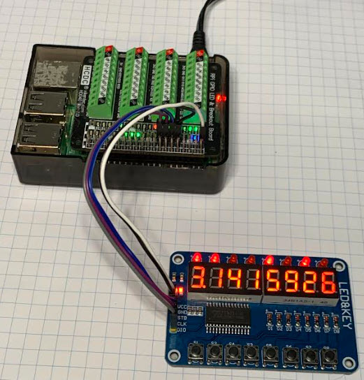
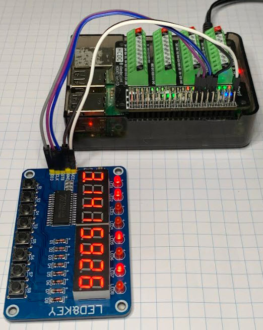
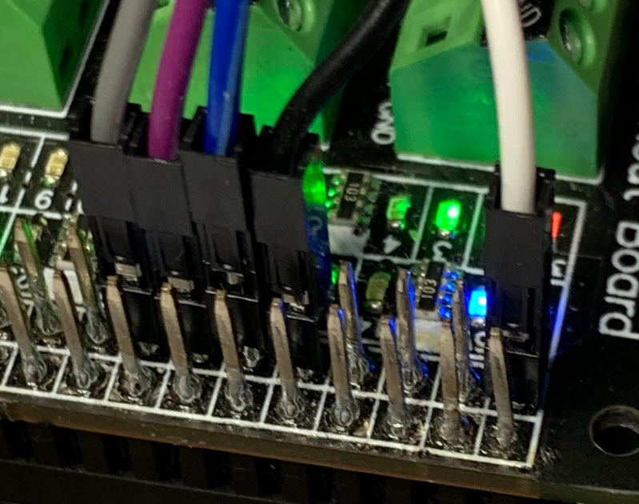

# GO for the LED8KEY board

Specifically, for the raspberry pi

# Wiring







# Links
  - https://blog.3d-logic.com/2015/01/10/using-a-tm1638-based-board-with-arduino/
  - https://rydepier.wordpress.com/2015/10/26/8-led-display-with-keys-and-leds-using-tm1638/
  - https://medium.com/@farissyariati/go-raspberry-pi-hello-world-tutorial-7e830d08b3ae

# Setup
```
sudo apt-get install golang

cd ~/go-led8key

go mod init example.com
go mod tidy

go run cmd/blinkTest.go
```

# 3D printed case for 16key

70.0mm square